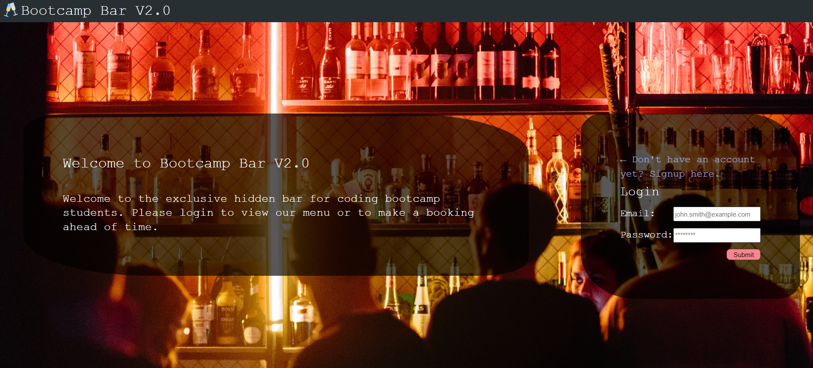
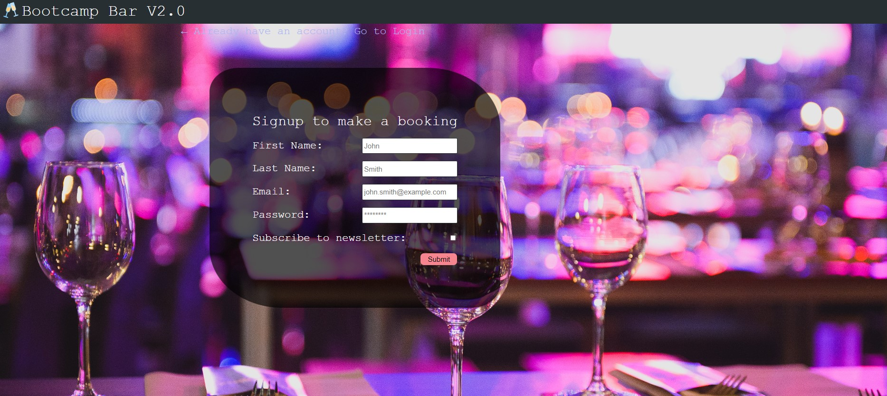

# Bootcamp_bar_V2.0

## Deployment link📌

🔸 Heroku Deployment [link](https://)

## Table of Contents

- [Project Description](#description)
- [User Story](#User-Story)
- [Credits](#Credits)
- [Screenshots](#Screenshots)
- [Future Development](#future-development)
- [Contributors](#contributors)
- [License](#license)

## Project Description

 This application allows users to make a reservation online for a seat at the Bootcamp Bar. Features include:

- 24 hour usage and response
- When a user signs up for an account, a confirmation email is sent to the user
- Automatically tests for capacity when the user attempts to make a reservation, will not allow the user to make a reservation if the capacity is full
- User can add, delete and modify their booking
- Drinks menu page with upvote and downvote

## User Story 👨

```http
As a customer, I want to be able to retrieve, add, update, and delete a booking at the bootcamp bar so that I can plan my night ahead of time and modify a booking if the situation demands it.”
```

## Credits

Third-party resources used:

- React: <https://reactjs.org/>
- Nodemailer: <https://nodemailer.com/about/>
- Bycrypt: <https://www.npmjs.com/package/bcrypt>
- Dotenv: <https://www.npmjs.com/package/dotenv>
- Eslint:<https://www.npmjs.com/package/eslint>
- Express JS: <https://expressjs.com/>
- graphQL: <https://graphql.org/>
- mongo DB: <https://www.mongodb.com/>
- JWT: <https://jwt.io/>

## Screenshots






## Future Development

Features that would be included in future development:

- Payment System - Allowing clients to pay their bill and reservation online.
- Mobile app - Creating App for faster operation and personalized experience.
- Chatbot - an app that aids in customer service, engagement, and support by replacing or augmenting human support agents with artificial intelligence (AI)
- Table picker - A map showing where tables are located and how many seats are available


## Contributors

🔸 Janine [Github](https://github.com/jmdg1023) 

🔸 Anisha [Github](https://github.com/anisha-sapkota)

🔸 Salina [Github](https://github.com/slingshort)


## License

This project is licensed under the [MIT license](https://opensource.org/licenses/MIT), please click on the link to find out more.
